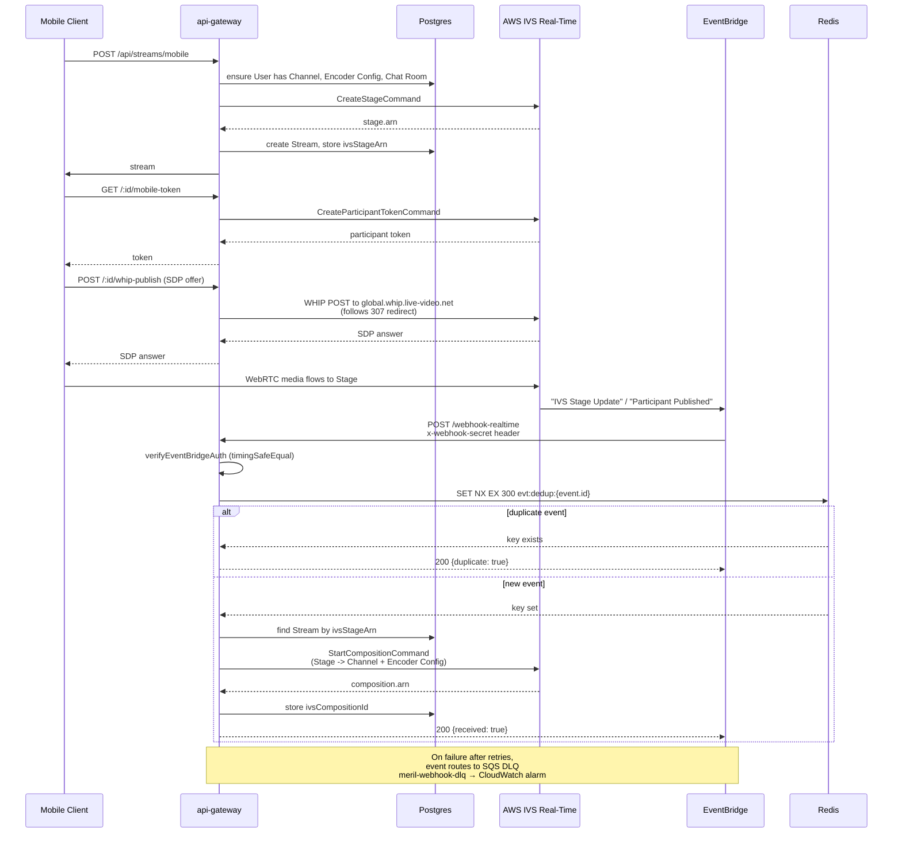
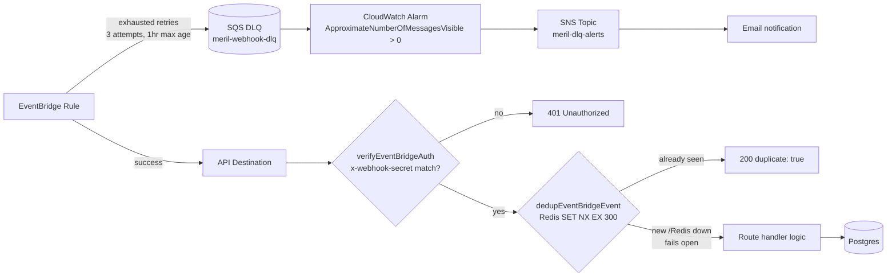
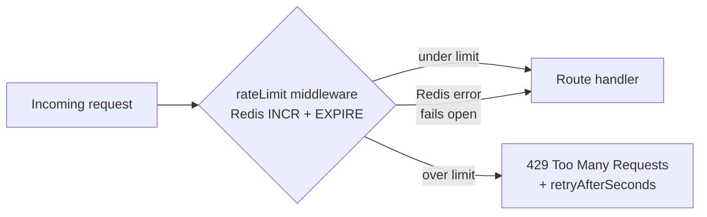
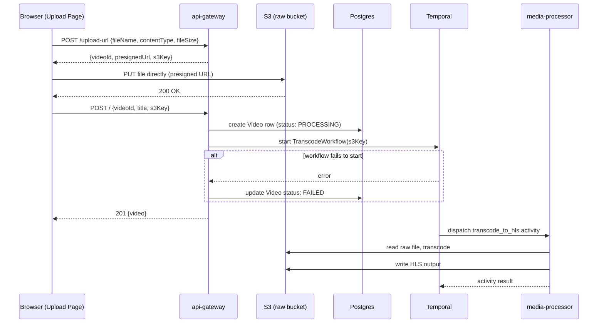

# Meril

Meril is a live streaming platform supporting both desktop (RTMP) and mobile (WHIP) broadcasting.

## Stack

| Layer                                              | Technology                               |
| -------------------------------------------------- | ---------------------------------------- |
| Frontend                                           | Next.js (Vercel)                         |
| API                                                | Express `api-gateway`                    |
| Database                                           | Postgres                                 |
| Cache /Idempotency                                 | Redis                                    |
| Media (RTMP/WHIP Ingest, transcoding, playback)    | AWS IVS                                  |
| Real-time / multi-participant                      | AWS IVS Real-Time (Stages, Compositions) |
| Chat                                               | AWS IVS Chat                             |
| Event routing                                      | AWS EventBridge                          |
| Auth                                               | AWS Cognito                              |
| Storage / CDN                                      | AWS S3 + CloudFront                      |
| Workflow Orchestration                             | Temporal                                 |
| Background processing                              | `media-processor` worker                 |
| Async events (view tracking, transcode completion) | Confluent Cloud (Kafka)                  |
| Monorepo tooling                                   | pnpm                                     |

## High-level System Design

**_adding soon_**

Clients connect to Meril app, which branches into three service areas - Auth (Cognito-backed token verification), Live Stream (desktop RTMP /mobile WHIP into AWS IVS, with IVS Chat), and Video Upload (presigned S3 upload feeding a Temporal transcode workflow). EventBridge routes IVS state-change events back into the app, with Redis handling both rate limiting and webhook dedup, and a full SQS DLQ -> CloudWatch -> SNS alerting chain for failed webhook deliveries. Video views and transcode-completion events flow through Kafka into a shared event-consumer, writing to the same Postgres database used by the rest of the app. Playback (both live and VOD) is served back to clients via CloudFront.

## Mobile go-live pipeline

WebRTC ingest through a Stage, composited into a Channel, with event-driven state updates.



## Webhook Dedup + DLQ



**Design notes:**

- `verifyEventBridgeAuth` uses `crypto.timingSafeEqual` rather than a plain string comparison, avoiding timing-attack leakage on the shared secret.
- The DLQ is a safety net, not the primary path - most events should never reach it. Its only job is to make otherwise-silent failures visible via the CloudWatch alarm.

## Rate Limiting

Applied as Express middleware using the same Redis instance as webhook dedup. Uses a fixed-window counter: `INCR` on a per-key window, `EXPIRE` set on first increment, `429` once the count exceeds the configured max.



| Route                                       | Window | Max requests | Key                             |
| ------------------------------------------- | ------ | ------------ | ------------------------------- |
| `POST /api/streams/` (desktop go-live)      | 60s    | 3            | per user                        |
| `POST /api/streams/mobile` (mobile go-live) | 60s    | 3            | per user                        |
| `GET /api/streams/:id/mobile-token`         | 60s    | 5            | per user                        |
| `POST /api/streams/:id/chat-token`          | 60s    | 10           | per IP (guests have no user id) |

## Video upload & Transcode Pipeline



## Local development

1. Start infrastructure:

```bash
  docker compose -f infra/docker-compose.yml up postgres redis temporal temporal-ui -d
```

2. Start each service

```bash
  cd services/api-gateway && npx tsx watch src/index.ts
  cd services/media-processor && uv run python -m src.worker
  cd services/event-consumer && npx tsx watch src/index.ts
  cd apps/web && pnpm dev
```

Once running:

- Frontend: `http://localhost:3000`
- API: `http://localhost:4000`
- Temporal UI: `http://localhost:8080`
